# StudyFlow 
A simple study planning application designed to help students organize tasks, manage subjects, and track their academic progress through an intuitive Kanban-style dashboard.

# Features

### Kanban Style Task Manager: 
A structured task management interface that allows users to visualize their study workload across "To Do," "In Progress," and "Done" states with manual status transitions.

### Progress Tracking: 
Provides a clear, real-time overview of academic progress by calculating task completion rates and subject-specific workload distribution.

### Study Session Timer: 
An integrated focus tool that allows users to start and manage study sessions, helping them maintain productivity on specific tasks.

### Cloud Sync: 
Backend integration with Supabase, ensuring secure data persistence and synchronization of tasks across sessions.

### Reactive State Management: 
Built with Riverpod to handle data updates efficiently, ensuring the UI remains perfectly in sync with the database. 

### Tech Stack
- Language/Framework: Flutter (Dart)

- Backend: Supabase (Auth & Database)

- State Management: Riverpod

- UI/UX: Implemented a modern & minimalistic design 

### How to Run
- Clone this repository: git clone [YOUR_REPO_URL]

- Install dependencies: flutter pub get

- Configure your Supabase environment variables.

- Run the app: flutter run

---

# Project Structure Overview

## auth Folder
Includes auth_provider.dart and login/signup screens; this folder manages all user authentication logic and session security.

## models Folder 
Contains task_model.dart; this is where the data structure and schema for the  tasks are defined.

## pages Folder 
Houses all UI screens like dashboard_page.dart and kanban_board.dart; this is the visual layer of the app.

## providers Folder
Contains tasks_provider.dart; this handles the global application state and real-time synchronization of the task data.

## widgets Folder
Includes app_header.dart; this folder holds reusable UI components to ensure design consistency across the app.

## main.dart 
The root of the application; it initializes the app, providers, and the initial routing.

---

# SCREENS:

### Splash Page: 
A simple loading screen that will take the user to the landing page.

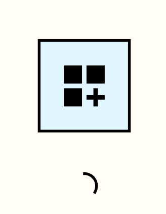 

---

### Landing Page: 
The entry point for users, featuring a clean, minimal design and a "Get Started" call-to-action.
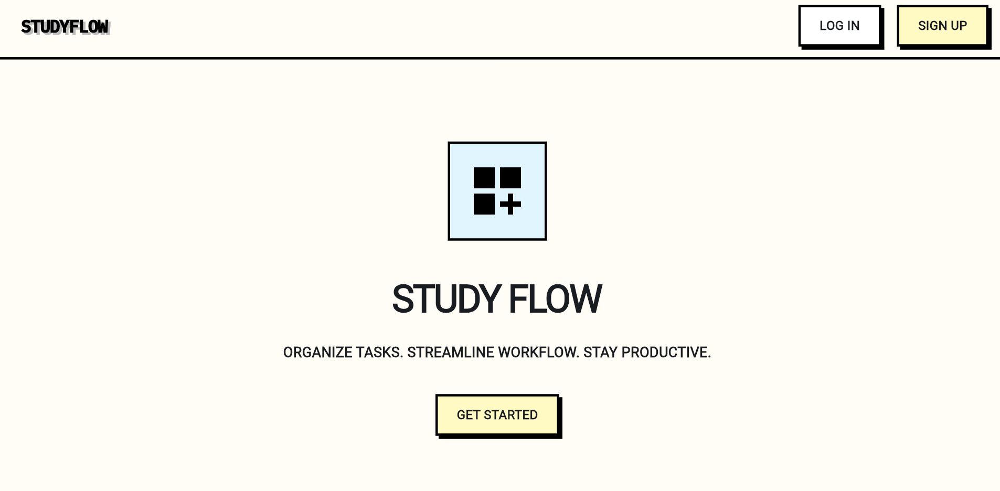 

---

### Login/Signup/Reset Pages: 
Secure authentication flows with simple, consistent UI for managing account access.

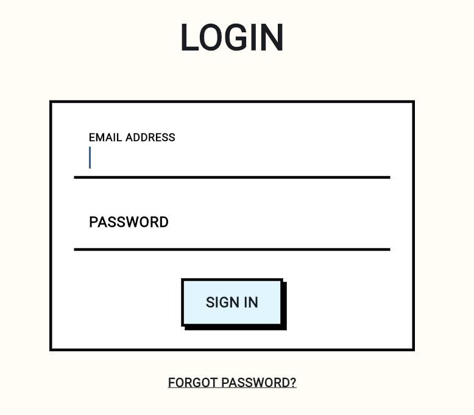 
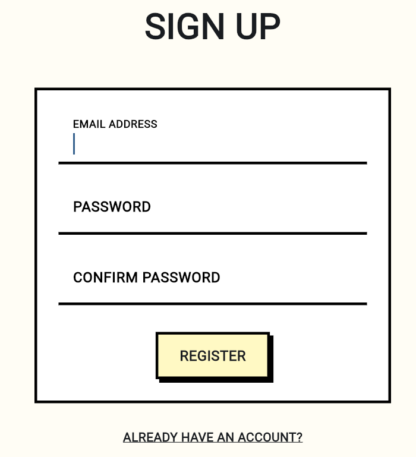 
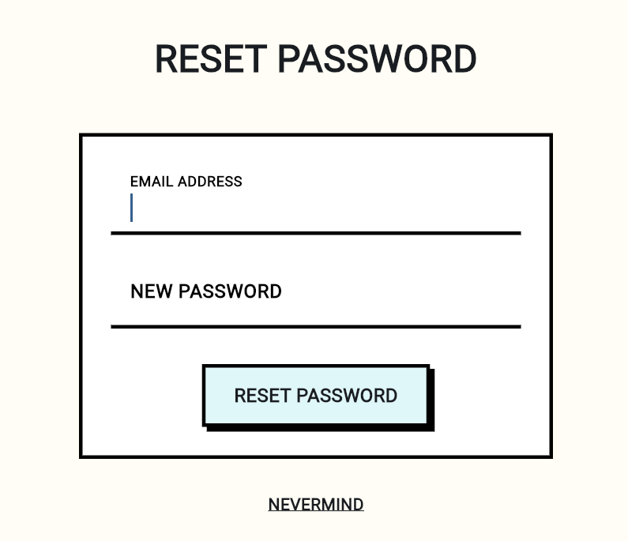 

---

### Dashboard Page: 
The central hub providing a high-level overview of progress, total tasks, and completion statistics.

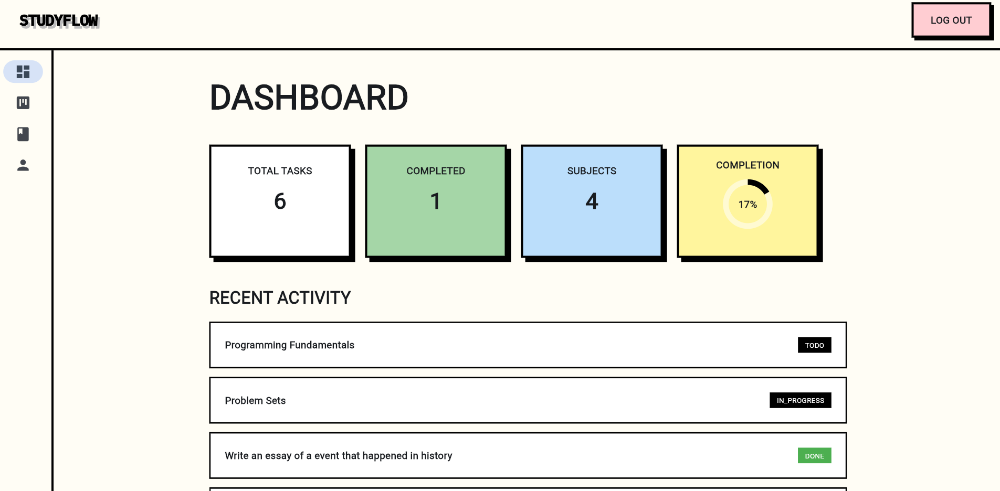 
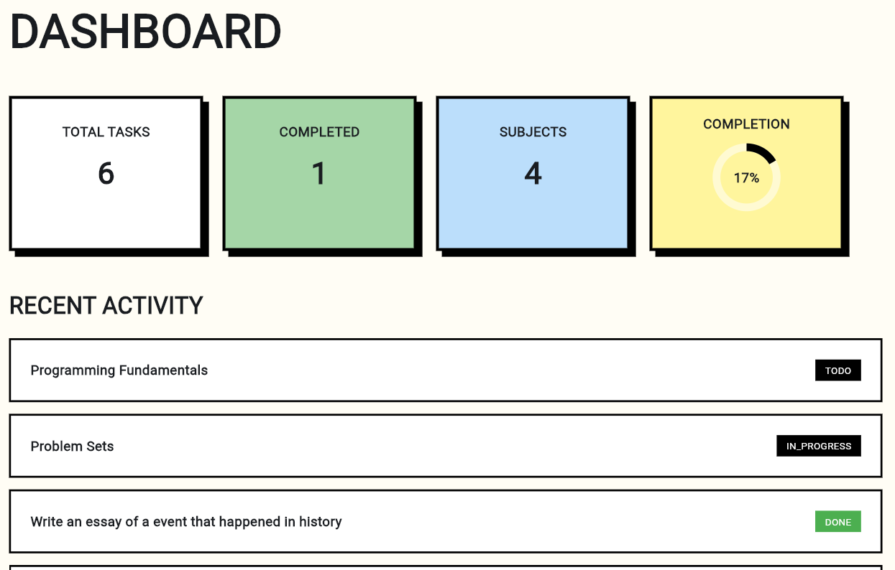 

---

### Kanban Board: 
A task manager for visualizing workflow states (To Do, In Progress, Done).

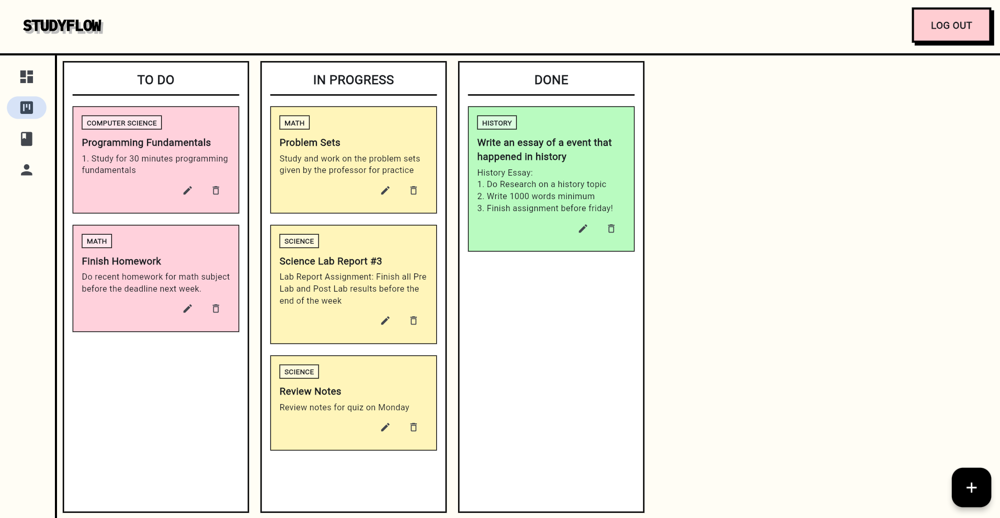 
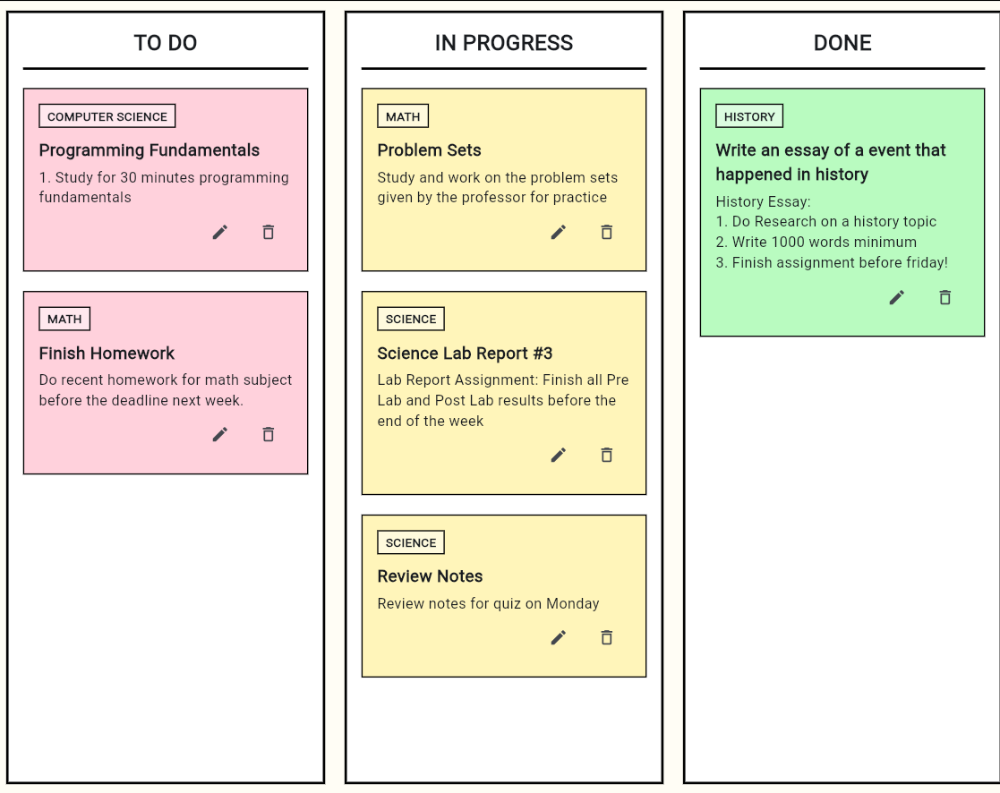 

---

### Create-Task Page: 
A screen accessed through the Kanban board where users can create a new task, inputing a subject (Defaults to General if left blank), and adding a description. 

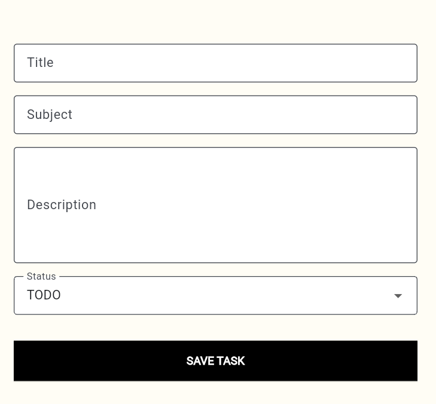 

---

### Study Planner/Session Page: 
A Study Session Page where the user can use the pomodoro timer for tasks that require focus, there are also filters for each subject.

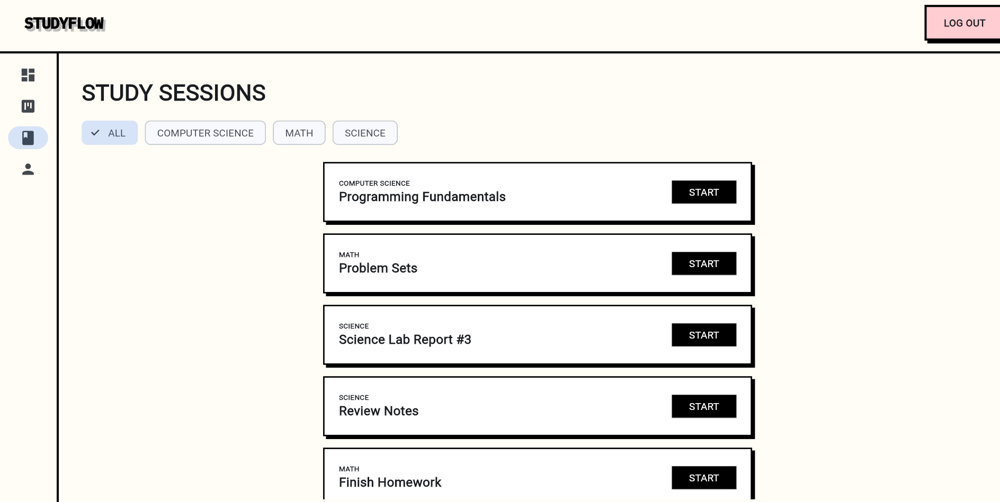 
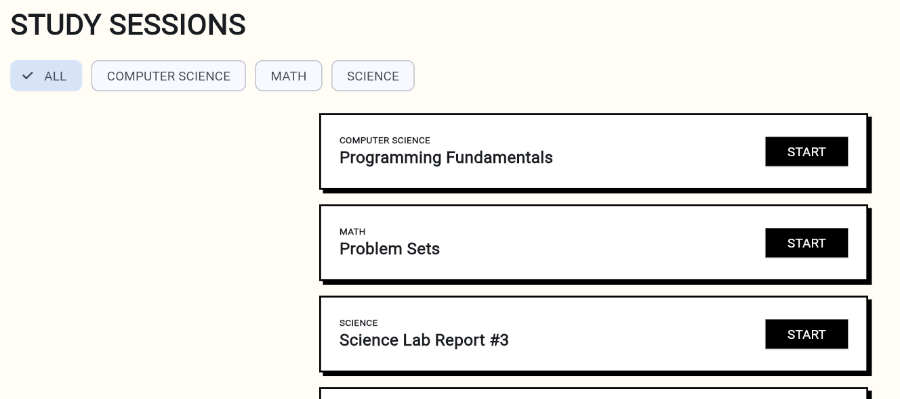 

---

### Pomodoro Timer: 
A focused, utility-driven overlay to keep users productive during active study sessions.

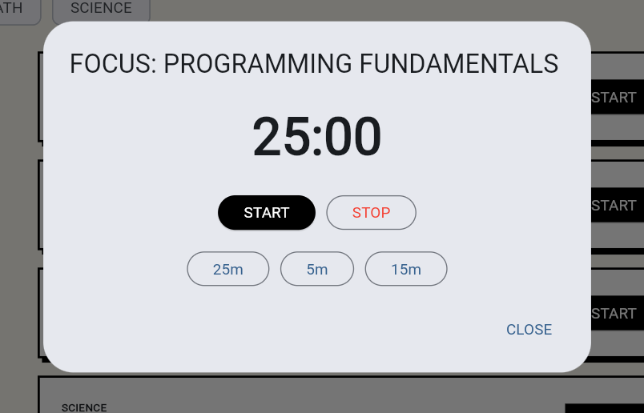 

---

### Profile Page: 
A user hub for account history of subjects & tasks.

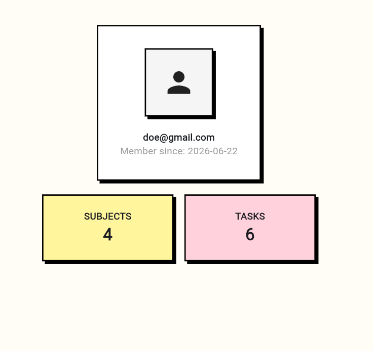 

---